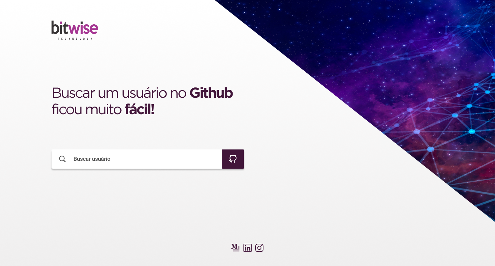

# Desafio Frontend - Bem-vindo a Bitwise

Somos Humanos e amamos trabalhar com pessoas humanas, pode parecer estranha essa frase, mas pense bem nas empresas que você já trabalhou e em algum momento você foi tratado como um robô ou pior como recurso, aqui sabemos que nossos **'wisers'** são a nossa assinatura, cultura e o motivo pelo qual nossa empresa existe.

Nosso modelo de negócios combina projetos de valor compartilhado com consultoria nas tecnologias mais avançadas. Esse desafio é uma oportunidade para fazer parte do nosso time em uma jornada de aprendizado e desenvolvimento!

## Que tipo de pessoas buscamos?

Buscamos pessoas que gostem de aprender, que não tenham medo de falhar e que não fiquem presas em paradigmas de programação, pois acreditamos que linguagens, frameworks o SDK's precisam ser escolhidas baseadas na necessidade de cada projeto. E o que isso quer dizer? Simples, quer dizer que nós amamos trabalhar com tecnologias de ponta e quem decidirá as ferramentas a serem utilizadas assim como a composição tecnológica será o time envolvido.

## Instruções para participar

- Crie sua conta no github, caso você não tenha uma
- Crie um novo fork do repositório do desafio
- Crie uma nova branch com seu nome-sobrenome
- Faça um pull request para o nosso repositório quando você terminar o desafio.
- Envie um email para douglas@bitwise.ltda para te adicionarmos ao time slack do desafio.

## O nosso desafio

Como você irá ver, nós somos fãs do Github e nada mais justo que fazer um desafio baseado nessa API sensacional! 

Bem, basicamente você tem a responsabilidade de criar uma webpage usando a [API de GraphQL do Github](https://docs.github.com/en/graphql) que tenha as seguintes features:

- Implementação do campo de busca pelo nome de usuários no github
- Caso o nome de usuário seja encontrado pela busca, mostrar imagem do perfil do github na pagina principal como está desenhada no Figma
- Caso o nome de usuário não seja encontrado mostrar um alerta informando que o usuário não existe.
- Caso o nome de usuário possua ou participe de algum repositório, então mostrar uma lista com 
  | Quantidade de repositórios do usuário | ( Participação e Repositórios criados pelo usuário )
  | Nome do Repo | Quantidade de commits do usuário | Mensagem do ultimo commit | Hash do ultimo commit | 
- Caso o nome de usuário não possua e nem participe de nenhum repositório mostrar um alert informando que o usuário encontrado não possui nenhum repo.

Você pode usar qualquer tipo de tecnologia para entregar o projeto como: ReactJS, VueJS, Ruby on Rails e etc.. Não existe limites ou formas erradas de fazer o projeto. 

OBS: *É muito importante para analisarmos sua capacidade de adaptação a novas tecnologias que o projeto seja implementado utilizando a **API de GraphQL**, mas se caso você encontre muitos problemas para entender ou implementar o GraphQL, como fallback você pode utilizar a versão **REST** , mas lembre-se, que ao fazer isso você irá perder uma grande quantidade pontos no nosso teste.*

## Interface no figma

 

Interface: https://www.figma.com/file/0yRZAx8GSGDhKpjXvjMf4A/Bitwise-tests-V2?node-id=0%3A1

### Adicionais

Caso você consiga completar todas tarefas acima e queira nós mostrar que você manja:
- Adicione ao campo de busca sugestões de nome de usuários, ou seja, quando usuário começar a digitar "mend" abaixo do campo de busca ira mostrar uma lista de nomes como: "mendos, mendesbarreto, mendeswhat" etc.. e quando usuário clicar em um desses nomes irá executar as atividades descritas acima.

OBS: O Github possui API para busca dos usuários

## O que iremos avaliar?

- Adaptação a novos tipos de tecnologias como API de GraphQL do Github
- Coesão das mensagens dos commits
- Testes automatizados como (Unit Test, UI Test ...)
- Estrutura do projeto
- Nomenclatura de classes, funções e métodos
- Conhecimento em CI/CD
- Aplicação de Design Patterns
- Nível de fidelidade/carinho do desenvolvimento da UI que entregamos no figama

