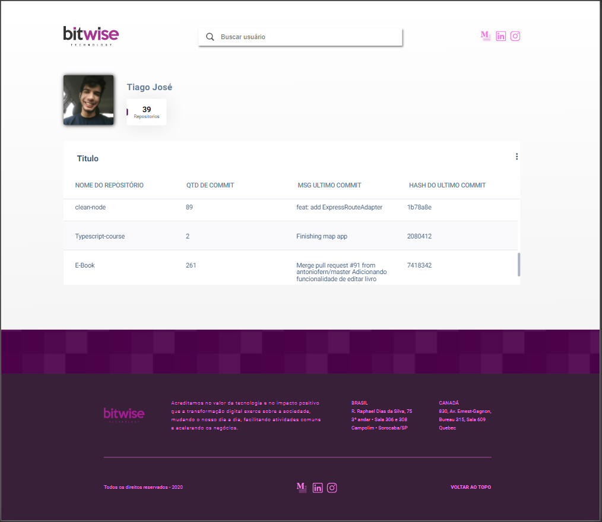

# Comandos para inicializar o projeto:
- Adicione um arquivo .env na raiz do projeto com a variável REACT_APP_GITHUB_TOKEN setada para o seu token de acesso a api do github
- **yarn** : Para fazer download de todas as dependências do projeto
- **yarn start** : Comando que inicializa o projeto localmente na porta : **3000**

# Sumário

Esse projeto foi feito para o teste da empresa Bitwise.

# Tecnologias

- HTML
- CSS
- SASS
- Typescript
- React
- React Router Dom
- Styled Components
- Apollo Client

# Images do projeto

## Home Page

## Search Page
